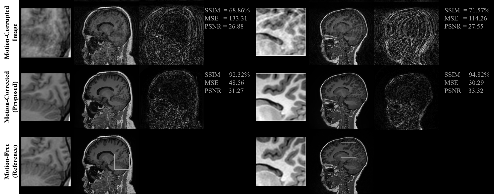

# Self-Assisted Priors Towards Robust Correction of Rigid Motion Artifact in Brain MRI




This project is developed to correct the motion artifacts in brain MRI. 

We propose an efficient retrospective method called self-assisted priors with cascaded refinement network for Reduction of Rigid Motion Artifacts in Brain MRI. 


# Python Code

We make the source code publicly available for researchers for validation and further improvement.

The python code includes the main.py (train and test) and model.py network.

# Our submitted Paper

This work has been submitted to one of the peer-reviewed scientific journals.

Also, you can find the preprint copy on arXiv at: https://arxiv.org/abs/2111.06401
The final version of this work is published in Neuroimage journal: https://www.sciencedirect.com/science/article/pii/S1053811922005286?via%3Dihub

# Citing 
If you find this work is useful for your research, please consider citing:

```
@article{ALMASNI2022119411,
title = {Stacked U-Nets with self-assisted priors towards robust correction of rigid motion artifact in brain MRI},
journal = {NeuroImage},
volume = {259},
pages = {119411},
year = {2022},
issn = {1053-8119},
doi = {https://doi.org/10.1016/j.neuroimage.2022.119411},
url = {https://www.sciencedirect.com/science/article/pii/S1053811922005286},
author = {Mohammed A. Al-masni and Seul Lee and Jaeuk Yi and Sewook Kim and Sung-Min Gho and Young Hun Choi and Dong-Hyun Kim},
keywords = {Deep learning, Motion artifact correction, MRI, Prior-assisted, Stacked U-Nets},
abstract = {Magnetic Resonance Imaging (MRI) is sensitive to motion caused by patient movement due to the relatively long data acquisition time. This could cause severe degradation of image quality and therefore affect the overall diagnosis. In this paper, we develop an efficient retrospective 2D deep learning method called stacked U-Nets with self-assisted priors to address the problem of rigid motion artifacts in 3D brain MRI. The proposed work exploits the usage of additional knowledge priors from the corrupted images themselves without the need for additional contrast data. The proposed network learns the missed structural details through sharing auxiliary information from the contiguous slices of the same distorted subject. We further design a refinement stacked U-Nets that facilitates preserving the spatial image details and improves the pixel-to-pixel dependency. To perform network training, simulation of MRI motion artifacts is inevitable. The proposed network is optimized by minimizing the loss of structural similarity (SSIM) using the synthesized motion-corrupted images from 83 real motion-free subjects. We present an intensive analysis using various types of image priors: the proposed self-assisted priors and priors from other image contrast of the same subject. The experimental analysis proves the effectiveness and feasibility of our self-assisted priors since it does not require any further data scans. The overall image quality of the motion-corrected images via the proposed motion correction network significantly improves SSIM from 71.66% to 95.03% and declines the mean square error from 99.25 to 29.76. These results indicate the high similarity of the brain's anatomical structure in the corrected images compared to the motion-free data. The motion-corrected results of both the simulated and real motion data showed the potential of the proposed motion correction network to be feasible and applicable in clinical practices.}
}
```
